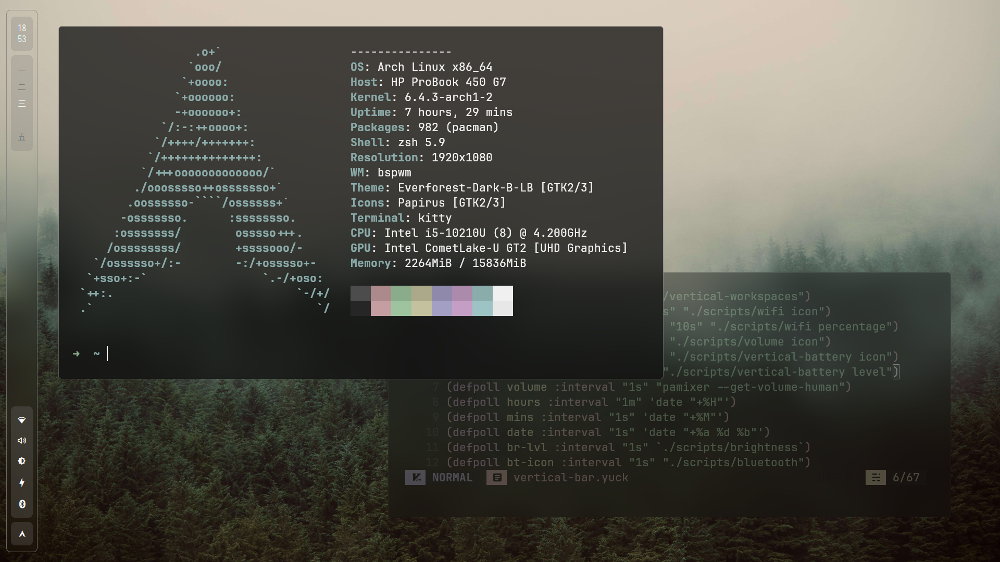
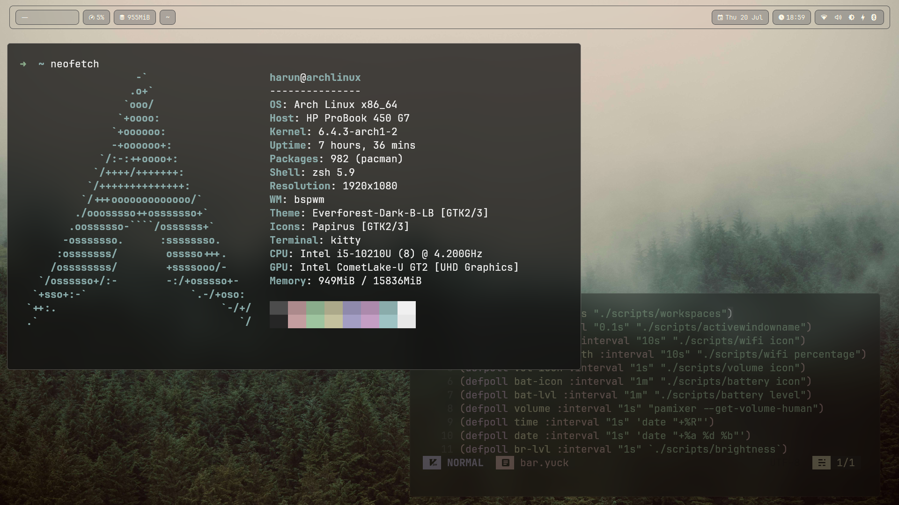

# dotfiles by sudo-harun

⭐ If you like these, please star! ⭐

## <a href="https://github.com/sudo-harun/dotfiles/tree/hyprland">Hyprland config</a>

  ## Desktop (bar made with eww)
  

  ## Wofi
  

  ## Screenshooter (made in eww)
  

  ## Powermenu (made in eww)
  

 

## <a href="https://github.com/sudo-harun/dotfiles/tree/bspwm">BSPWM config</a>

### Vertical Bar

  
  

 

### Horizontal Bar

  
  

 

