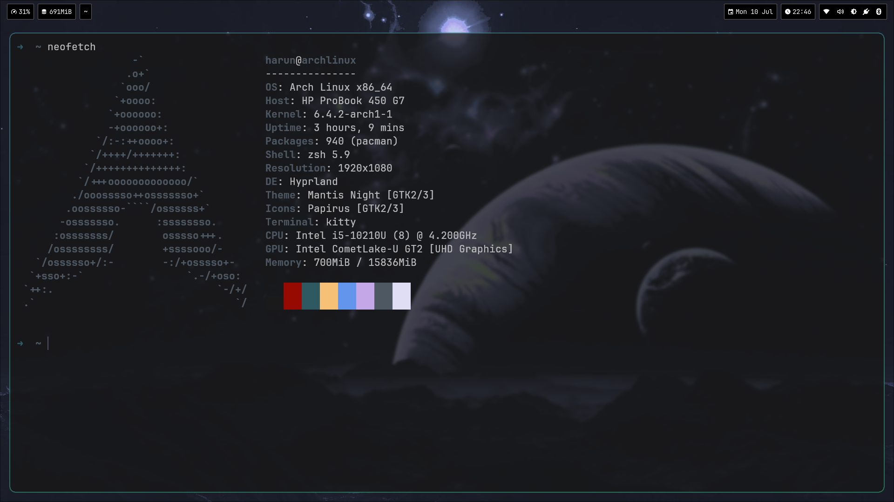

<h1>Hyprland config (ABANDONED)</h1>

<b>NOTE: Please do not use these dotfiles. They are from an abandoned Hyprland config which I plan to come back to in the future.</b>

<div align="center">
  
  
</div>

<h3>Installing Dependencies (Arch)</h3>

```
yay -S hyprland hyprpaper hyprshot nwg-look-bin
```
