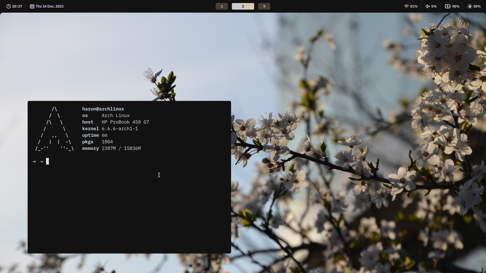
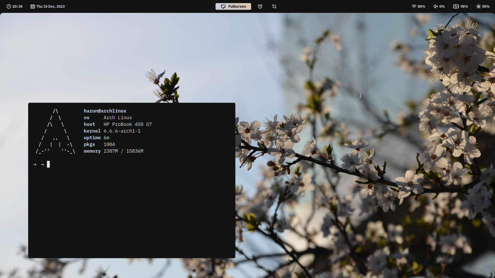
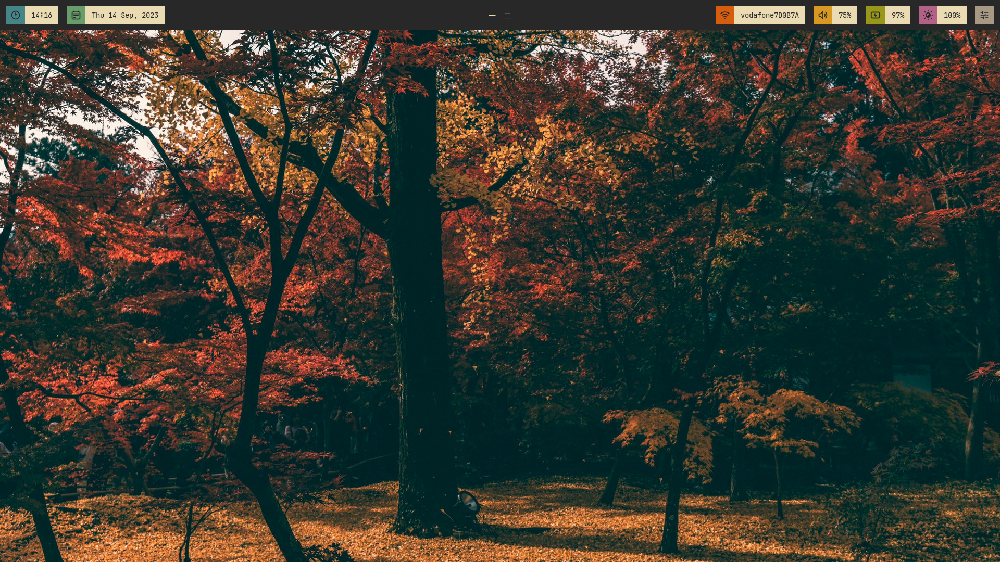
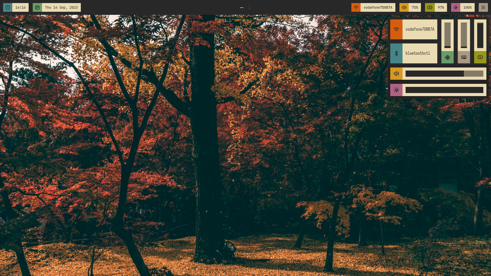
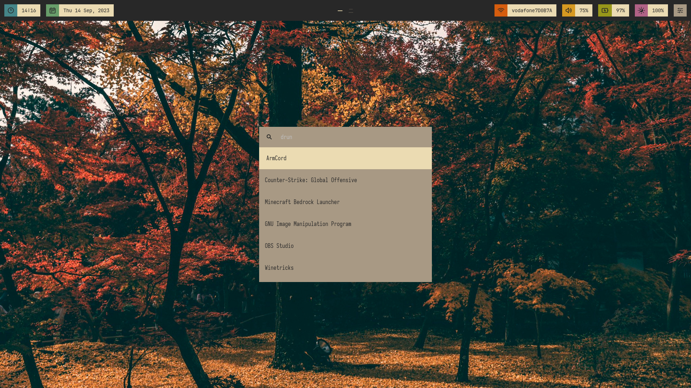
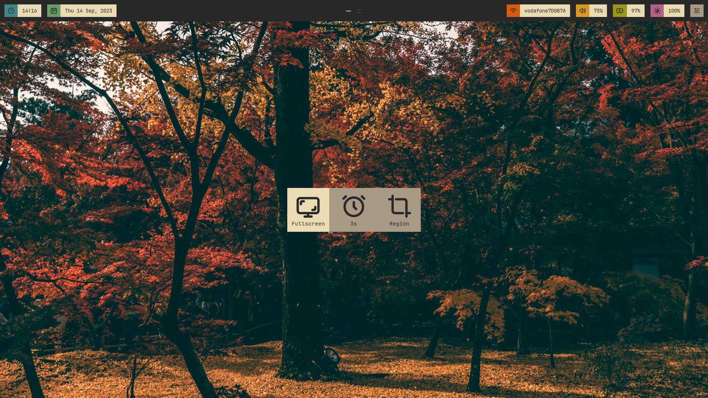
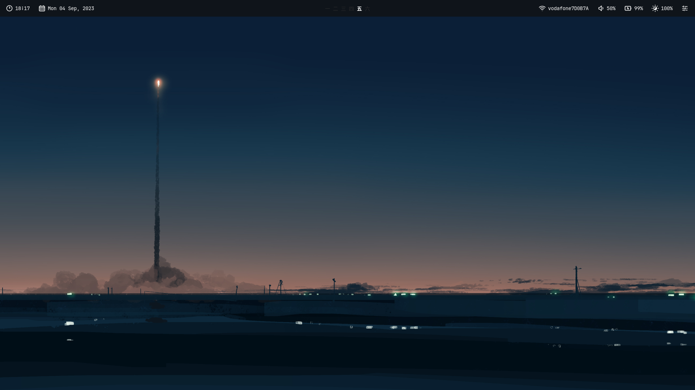
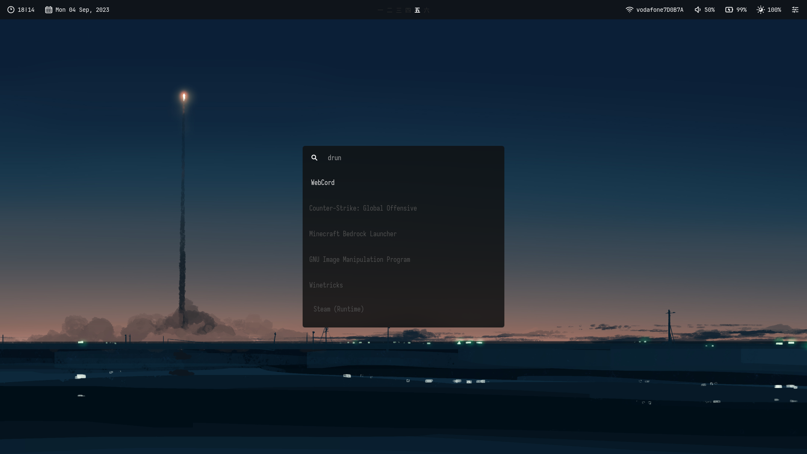
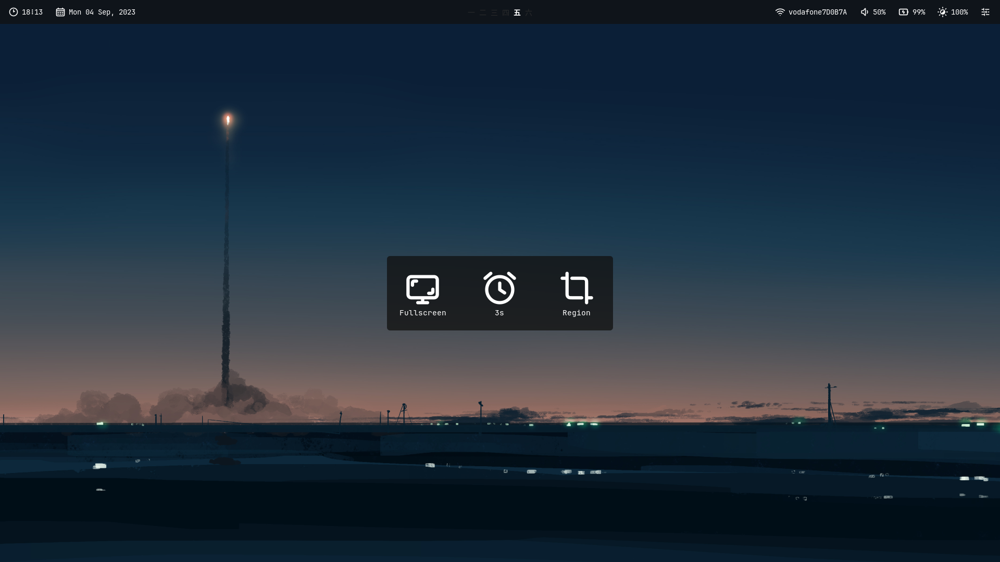

# Hyprland Dotfiles by sudo-harun

⭐ If you like these, please star! ⭐

## <a href="https://github.com/sudo-harun/dotfiles/tree/retroesque">Retro-esque: Another Hyprland Config</a>


### Desktop (All eww)


### Screenshooter (embedded into the bar)


### Powermenu (embedded into the bar)


## <a href="https://github.com/sudo-harun/dotfiles/tree/gruvbox">Another Gruvbox Hyprland Config</a>


### Desktop (bar made with eww)


### Control Center (made with eww)


### Wofi


### Screenshooter (made with eww)


### Powermenu (made with eww)


## <a href="https://github.com/sudo-harun/dotfiles/tree/generic">A Generic Hyprland Config</a>


### Desktop (bar made with eww)


### Wofi


### Screenshooter (made with eww)


### Powermenu (made with eww)


## Other stuff I use
To create custom themes, I use pywal. You can install it with the command below (Arch Linux only using yay):
```
yay -S python-pywal
```
