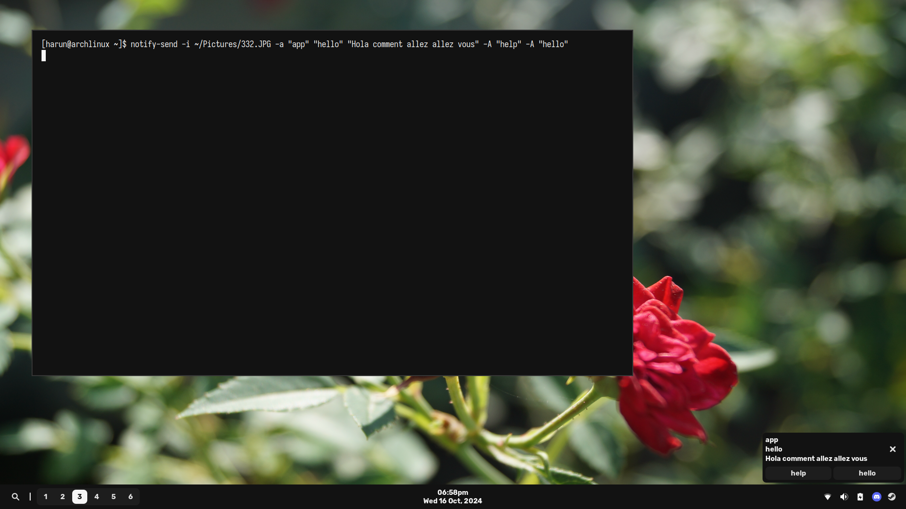

# Modernish, a Hyprland config (WIP)

<div align="center">
  
</div>

## Feature Roadmap

- [x] Bar
- [x] Notification Popups
- [ ] Notification Center (in progress)
- [ ] App Launcher
- [ ] Emoji Picker
- [ ] Controls Menus (individual menus for wifi, audio, etc.)

## Keybindings

- `Super + [num]` = Switch to workspace [num]
- `Alt + [num]` = Move active window to workspace [num]
- `Super + Enter` = Open `foot` terminal
- `Super + F` = Open Thunar File Manager (needs to be installed)
- `Super + B` = Open Firefox Web Browser
- `Super + Shift + B` = Open Firefox Private Window
- `Super + Q` = Kill active application
- `Super + R` = Open wofi (application launcher)
- `Super + E` = Open wofi-emoji (emoji selector)
- `Super + Tab` = Switch application
- `Super + Escape` = Toggle fullscreen for active application
- `Super + F` = Toggle floating
- `Super + S` = Toggle split
- `Super + M` = Exit Hyprland
- `Print` = Take a screenshot (copied to clipboard only, additional functionality coming soon)

## How to install

You can either use `$ archinstall` and add `git` and `python` as additional packages, or follow the installation guide below.

### Arch Linux installation

NOTE: I made this guide using the Arch Linux Installation Guide and Artix Installation Guide.

After plugging in my usb with the Arch Linux ISO and booting into the Arch installer, I set my keyboard layout with `$ loadkeys`. In my case it's `$ loadkeys uk` since I have a British keyboard layout.

Next, I connect to wifi using `iwctl` (not necessary if on ethernet):
```
$ iwctl
[iwctl] station wlan0 scan
[iwctl] station wlan0 connect <essid>
[iwctl] quit
```

Next, I do stuff with the keyring and keys:
```
$ pacman-key --init
$ pacman-key --populate archlinux
$ pacman -Sy archlinux-keyring
```

If I get any errors with the above, I do the following then repeat the above:
```
$ killall gpg-agent
$ rm -rf /etc/pacman.d/gnupg
```

Afterwards, I create my partition table on my NVME drive using `cfdisk`. In my case, I do `cfdisk /dev/nvme0n1`.
I delete all partitions and make 3 partitions:
- The first partition is going to be the EFI partition. I make it 500M in size, and the filesystem type is EFI
- The second partition is the swap partition. I make it half of my RAM size. I have 16G of RAM, so I make the swap partition 8G. The filesystem type is Linux Swap.
- The third and last partition is my root partition. I give it the remaining space and the filesystem type is Linux Filesystem.

Next, I make my partitions:
```
$ mkfs.fat -F 32 /dev/nvme0n1p1   # This is my EFI partition
$ mkswap /dev/nvme0n1p2           # This is my swap partition
$ mkfs.ext4 /dev/nvme0n1p3        # This is my root partition
```

After that, I mount my partitions:
```
$ mount /dev/nvme0n1p3 /mnt
$ mount --mkdir /dev/nvme0n1p1 /mnt/boot/efi
$ swapon /dev/nvme0n1p2
```

Time to `pacstrap` and install the base system:
```
$ pacstrap -K /mnt base base-devel linux linux-firmware networkmanager grub efibootmgr os-prober neovim git python
```

Now create your `fstab` file with `genfstab`:
```
$ genfstab -U /mnt >> /mnt/etc/fstab
```

Now, we can `chroot` into our system with `$ arch-chroot /mnt`.

Add your timezone by symlinking it to `/etc/localtime`. In my case, my timezone is London:
```
$ ln -sf /usr/share/zoneinfo/Europe/London /etc/localtime
```

And synchronize to your hardware clock:
```
$ hwclock --systohc
```

Next, setting up locales:
```
$ nvim /etc/locale.gen

# Uncomment the locales you want to use, in my case my main locale is en_GB.UTF-8 but I also want en_US.UTF-8 installed

$ locale-gen
$ nvim /etc/locale.conf

LANG=<main locale you want to use>

```

Set up your TTY keymap:
```
$ nvim /etc/vconsole.conf

KEYMAP=<your keymap>

```

Set hostname:
```
$ nvim /etc/hostname

# Put in whatever you want here as long as it's unique on your LAN, I just put:
archlinux

```


Next, create your user(s) and set appropriate permissions:
```
$ useradd -m <username>
$ usermod -aG video <username> # Set ability to change brightness
$ usermod -aG wheel <username> # Add ability to use super user commands, but won't work right now
$ passwd <username> # Set a password
$ passwd # Set a root password, optional
```

For the user of the wheel group to be able to run super user commands do:
```
$ visudo # Recommended, requires vi to be installed, or alternatively you can do nvim /etc/sudoers (not recommended)

...
# %wheel ALL=(ALL:ALL) ALL # Uncomment this line, usually towards the bottom of the file
...

```

Next, installing and configuring grub:
```
$ nvim /etc/default/grub

#GRUB_DISABLE_OS_PROBER=false # Uncomment this line, usually at the very bottom of the file


# Then do either of the 2 following commands:
$ grub-install --target=x86_64-efi --efi-directory=/boot/efi --bootloader-id=grub # Regular way of installing grub, no Secure Boot
$ grub-install --target=x86_64-efi --efi-directory=/boot/efi --bootloader-id=Grub --modules="tpm" --disable-shim-lock # If you want to setup Secure Boot

# Then finally:
$ grub-mkconfig -o /boot/grub/grub.cfg
```

Now exit, unmount partitions and reboot:
```
$ exit
$ umount -R /mnt
$ reboot
```

### After Arch Linux installation

Connect to wifi if applicable:
```
$ nmtui
```

Then update:
```
$ sudo pacman -Syu
```

Then you can do the following:
```
$ git clone -b modernish https://github.com/sudoharun/dotfiles.git
$ cd dotfiles
$ python install.py
```

### Tips and tricks

- Do `$ yay [package]` to search for a package


Please report any bugs or errors in documentation using Github Issues, or you can contact me on Discord. My Discord username is `sudoharun`.
