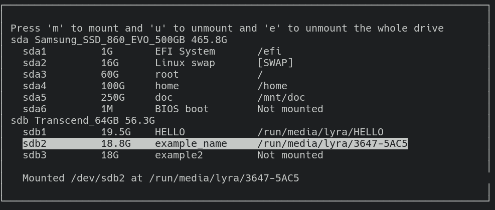

# Ranger udisk menu
This script draws menu to mount and unmount partitions using udisksctl and ncurses



# Requirements
- python3.8 or newer
- udisks2 (for udisksctl)
- lsblk 2.3 or newer

# How to install
Firstly you need to clone this repo to the plugins directory of ranger

```Bash
cd ~/.config/ranger/plugins
git clone https://github.com/SL-RU/ranger_udisk_menu
```

Then you need to add to `~/.config/ranger/commands.py` line: 

```Python3
from plugins.ranger_udisk_menu.mounter import mount
```

Thats all

# How to use
Enter in ranger `:mount`, than will be shown menu. In this menu you can press:

- `j` or `arrow down` or `Ctrl+n` to move selection down
- `k` or `arrow up` or `Ctrl+p` to move selection up
- `Ctrl+g` or `Esc` or `q` to quit
- `g` or `r` to refresh all partitions and drives
- `m` to mount selected partition
- `u` to unmount selected partition
- `e` to unmount all partitions of selected partition's drive
- `p` to power off selected the selected partition's drive (also called safely remove). It can be done only when all partitions of the drive are unmounted
- `ENTER` to open selected mountpoint in current tab of the ranger

# Troubles

If there is trouble with permissions, then you need to create group `storage` and add your user to it. Then you need to update your Polkit or PolicyKit permissions like it shown [here: https://github.com/coldfix/udiskie/wiki/Permissions](https://github.com/coldfix/udiskie/wiki/Permissions)
